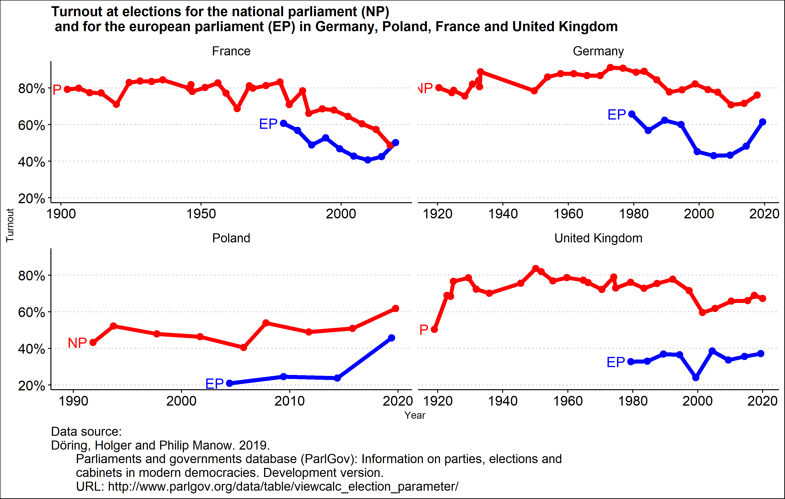

rstfuns - My personal R-Package
================

This is my personal R-Package containing various short functions I wrote
for various projects, mostly concerning topics of political science. My
main reasons for writing this package are a) to have written a R package
once and b) to have an easy, transparent and reproducible way of reusing
code between project. The idea for this small package was born after I
read [this](https://hilaryparker.com/2013/04/03/personal-r-packages/)
great blog-post by Hilary Parker.
[This](https://hilaryparker.com/2014/04/29/writing-an-r-package-from-scratch/)
other post of hers was a great help.

## Installation:

Installation of `rstfuns` requires `devtools`. If `devtools` is
installed `rstfuns` can be installed using:

    devtools::install_github("https://github.com/RStelzle/rstfuns", dependencies = T)
    library(rstfuns)

## Available functions:

### Roll-Call-Data:

Roll-Call-Data is one of the workhorse-data-sources of the sociology of
legaslatures, as it is -depending on the legislative body of interest-
relatively accessible. One topic of interest to be tackled with
Roll-Call-Data might be cohesion or discipline (for a distinction of the
two see Özbudun (1970)) of parliamentary groups. For questions of this
kind `rstfuns` contains two functions `calc_attina_index()` and
`calc_rice_index()`. Both indices can be used to measure cohesion within
a set of legislators for a given vote.

That being said, Roll-Call-Data should not be analysed without a word of
caution: As roll-call-votes are in most cases not staged randomly, any
inferences taken from a sample of roll-call-votes on the population of
all votes are built on shaky grounds. For a great overview see Carrubba
et al. (2006).

#### `calc_attina_index()`


With *M* being the count of votes given for the option with the most
votes and *N* being the total count of votes given, including votes to
abstain.

`calc_attina_index()` is used to calculate “Attina’s index of agreement”
(see Attina 1990, 564f.). Attina’s index of agreement can be used for
votes with the option to abstain from the vote, like in the European
Paraliament. `calc_attina_index()` takes a vector (max. `length()` = 3)
of the amount/share of votes for “yes”, “no” and “abstain”. When the
vector is shorter than `length() = 3` it is assumed that no legislators
voted for the missing option(s).

Attina’s index of agreement results values from -33.333 to 100. A value
of 100 represents a unanimous vote. Positive values result, if more than
half of the votes were casted for one and the same option. -33.33 means,
that equal shares of legislatures voted for “yes”, “no” and “abstain”.

`calc_attina_index()` takes the optional argument `rescale` (default =
`FALSE`). If set to `TRUE`, `calc_attina_index()`’s results get rescaled
to a scale of 0-1 (for exaple used in Hix, Noury, and Roland (2005)). A
value of 0.25 now represents that 50% of the values were casted for one
of the options.

#### `calc_rice_index()`


With *P* being the count of “Yes”-, *C* the count of “No” and *N* the
total count of votes.

`calc_rice_index()` is used to calculate the “Rice Index” as defined in
Rice (1925, 62f.). It can be used for votes without an option to
abstain. Therefore `calc_rice_index()` only takes a vector of max.
`length()` = 2. The Rice Index varies between 1 (all votes where casted
for the same option) and 0 (votes where evenly split between “yes” and
“no”).

### Utility stuff

#### `plot_turnout_parlgov()`

``` r
rstfuns::plot_turnout_parlgov(c("Germany", "Poland", "France", "United Kingdom"), german = F)
```

    ## [1] "Preparing turnout-plot for Germany"       
    ## [2] "Preparing turnout-plot for Poland"        
    ## [3] "Preparing turnout-plot for France"        
    ## [4] "Preparing turnout-plot for United Kingdom"
    ## [1] "Germany, Poland, France and United Kingdom"

<!-- -->

`plot_turnout_parlgov()` can be used for quick and dirty plotting of
election turnout in countries. Data from the ParlGov Database (Döring
and Manow 2019) is used. The function takes one optional argument. If
set to `german = T` countrynames will be translated to German and “and”
will be replaced by “und”.

# References

<div id="refs" class="references">

<div id="ref-attinaVotingBehaviourEuropean1990c">

Attina, Fulvio. 1990. “The Voting Behaviour of the European Parliament
Members and the Problem of the Europarties.” *Eur J Political Res* 18
(5): 557–79. <https://doi.org/10.1111/j.1475-6765.1990.tb00248.x>.

</div>

<div id="ref-carrubbaRecordUnrecordedLegislative2006">

Carrubba, Clifford J., Matthew Gabel, Lacey Murrah, Ryan Clough,
Elizabeth Montgomery, and Rebecca Schambach. 2006. “Off the Record:
Unrecorded Legislative Votes, Selection Bias and Roll-Call Vote
Analysis.” *Brit. J. Polit. Sci.* 36 (4): 691–704.
<https://doi.org/10.1017/S0007123406000366>.

</div>

<div id="ref-doringParliamentsGovernmentsDatabase2019">

Döring, Holger, and Philip Manow. 2019. “Parliaments and Governments
Database (ParlGov): Information on Parties, Elections and Cabinets in
Modern Democracies. Development Version.” http://www.parlgov.org/.

</div>

<div id="ref-hixPowerPartiesCohesion2005">

Hix, Simon, Abdul Noury, and Gérard Roland. 2005. “Power to the Parties:
Cohesion and Competition in the European Parliament, 19792001.” *British
Journal of Political Science* 35 (2): 209–34.
<https://doi.org/10.1017/S0007123405000128>.

</div>

<div id="ref-ozbudunPartyCohesionWestern1970">

Özbudun, Ergun. 1970. “Party Cohesion in Western Democracies: A Causal
Analysis.” *Sage Professional Papers in Comparative Politics* 1 (6):
303–88.

</div>

<div id="ref-riceBehaviorLegislativeGroups1925">

Rice, Stuart A. 1925. “The Behavior of Legislative Groups: A Method of
Measurement.” *Political Science Quarterly* 40 (1): 60–72.
<https://doi.org/10.2307/2142407>.

</div>

</div>
